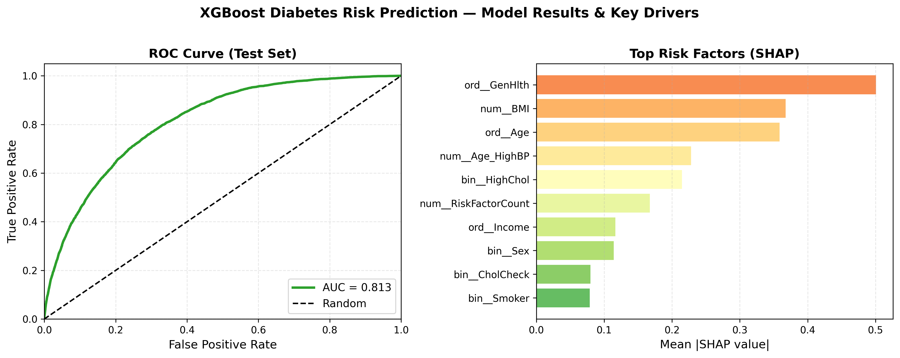

# Diabetes Risk Prediction and Health Insights

End-to-end data mining project on the CDC Diabetes Health Indicators dataset. Covers exploratory analysis, binary and multiclass classification with XGBoost, K-Means clustering for patient risk profiling, and association rule mining — with full model explainability via SHAP and LIME.

---

## Project Overview

**Dataset:** [CDC Diabetes Health Indicators](https://www.kaggle.com/datasets/alexteboul/diabetes-health-indicators-dataset) — 253,680 US adult survey responses from the 2014 Behavioral Risk Factor Surveillance System (BRFSS), 22 features. After deduplication: 229,781 clean records.

**Target variable:** `Diabetes_012` — three classes: No Diabetes (~83%), Pre-diabetes (~2%), Diabetes (~15%).

The project asks two questions:
1. Can we accurately predict diabetes status from self-reported health indicators?
2. What combinations of risk factors are most strongly associated with a diabetes outcome?

---

## Key Results

| Task | Model | Key Metric |
|---|---|---|
| Binary classification | XGBoost + Optuna, threshold = 0.630 | ROC-AUC **0.813**, PR-AUC **0.478**, MCC **0.371**, sensitivity **0.596**, specificity **0.827** |
| Multiclass classification | XGBoost + Optuna + isotonic calibration | Balanced accuracy **0.511**, F1-macro **0.431**, ROC-AUC OvR macro **0.763**, recall at-risk **0.822** |
| Clustering | K-Means (k=4, full feature set) | 4 distinct patient profiles with diabetes prevalence ranging from low to high risk |
| Association rule mining | Apriori (mlxtend) | Top rule: DiffWalk + HeartDiseaseorAttack → Diabetes (confidence **0.465**, lift **2.69**) |

**Association rules:** 12 rules with confidence 0.387–0.465 and lift 2.24–2.69. See `data/processed/ARM_Top_Rules.csv`.

**Top predictors (SHAP + permutation importance):** General health rating, BMI, age, high blood pressure, high cholesterol, difficulty walking, heart disease history.



---

## Tech Stack

- **Language:** Python 3
- **ML / modelling:** scikit-learn, XGBoost, Optuna
- **Explainability:** SHAP, LIME
- **Association rule mining:** mlxtend
- **Data:** pandas, NumPy
- **Visualisation:** matplotlib, seaborn
- **Notebooks:** Jupyter

---

## Repository Structure

```
diabetes-risk/
├── notebooks/
│   ├── 02_eda.ipynb                                        # EDA, deduplication, prevalence charts
│   ├── 03_feature_engineering_classification_multi.ipynb   # 3-class classification pipeline
│   ├── 03a_feature_engineering_classification_binary.ipynb # Binary classification + explainability
│   ├── 04_clustering.ipynb                                 # K-Means across 7 feature subsets
│   └── 05_association_mining.ipynb                         # Apriori association rule mining
│
├── data/
│   ├── raw/                                                # Place CDC dataset here (not tracked)
│   └── processed/
│       ├── CDC_Diabetes_Dataset_clean.csv                  # Deduplicated dataset (output of 02)
│       ├── CDC_Diabetes_Dataset_feature_set_A.csv          # Engineered features + train/eval/test split
│       └── ARM_Top_Rules.csv                               # Top association rules (output of 05)
│
├── figures/
│   ├── eda/                                                # Prevalence charts, distributions
│   ├── results_binary/                                     # Binary model outputs (SHAP, LIME, confusion matrices)
│   ├── results_multi/                                      # Multiclass model outputs
│   └── results_clustering/                                 # Elbow, silhouette, cluster scatter plots
│
├── archive/                                                # Superseded notebooks (kept for reference)
│   ├── 01_data_loading.ipynb
│   └── 04_feature_engineering_classification_binary_copilot.ipynb
│
├── requirements.txt
└── README.md
```

> **Note:** The raw dataset (`data/raw/CDC_Diabetes_Dataset.csv`) is not tracked due to file size. Download from [Kaggle](https://www.kaggle.com/datasets/alexteboul/diabetes-health-indicators-dataset) and place it at `data/raw/CDC_Diabetes_Dataset.csv` before running notebook `02_eda.ipynb`.

---

## How to Run

### 1. Clone the repo

```bash
git clone https://github.com/dawoodahmedbutt/diabetes-risk.git
cd diabetes-risk
```

### 2. Set up a virtual environment

> **Note:** If your project lives on an external drive (exFAT/NTFS), create the venv on your local drive to avoid macOS AppleDouble file conflicts with pip.

```bash
# Local drive (recommended for external drives)
python -m venv ~/.venvs/diabetes-risk
source ~/.venvs/diabetes-risk/bin/activate

# Or inside the project (works fine on APFS/HFS+)
python -m venv venv
source venv/bin/activate        # Windows: venv\Scripts\activate
```

```bash
pip install -r requirements.txt
```

**Jupyter kernel** (run once after creating the venv):

```bash
python -m ipykernel install --user --name diabetes-risk --display-name "Python (diabetes-risk)"
```

Then select **Python (diabetes-risk)** as the kernel when opening notebooks.

### 3. Download the dataset

Download `CDC_Diabetes_Health_Indicators_BRFSS2015.csv` from [Kaggle](https://www.kaggle.com/datasets/alexteboul/diabetes-health-indicators-dataset) and save it as:

```
data/raw/CDC_Diabetes_Dataset.csv
```

### 4. Run notebooks in order

```
02_eda.ipynb                                        → generates cleaned data + EDA figures
03_feature_engineering_classification_multi.ipynb   → multiclass models
03a_feature_engineering_classification_binary.ipynb → binary models + full explainability
04_clustering.ipynb                                 → K-Means clustering
05_association_mining.ipynb                         → association rules
```

---

## Notebook Summaries

### `02_eda.ipynb` — Exploratory Data Analysis
Loads the raw CDC dataset, removes 23,899 duplicate rows, and explores the target variable and all 22 features. Key findings: diabetes prevalence rises sharply with age, lower income and education are associated with higher prevalence, and binary health indicators (HighBP, HighChol, HeartDiseaseorAttack, DiffWalk) show the strongest separation.

### `03_feature_engineering_classification_multi.ipynb` — Multiclass Classification
Trains a 3-class classifier (No Diabetes / Pre-diabetes / Diabetes). Baseline logistic regression → class-weighted LR → feature engineering (Feature Set A) → XGBoost baseline → XGBoost + class weights → Optuna tuning (30 trials) → isotonic calibration → SHAP global analysis.

### `03a_feature_engineering_classification_binary.ipynb` — Binary Classification
Collapses pre-diabetes and diabetes into a single positive class. Full pipeline from LR baseline through Optuna-tuned XGBoost with MCC-optimised threshold and isotonic calibration. Explainability: permutation importance, global SHAP (bar + beeswarm), local SHAP and LIME for 8 representative cases (TP/FP/TN/FN × high-confidence and borderline), with side-by-side SHAP/LIME comparison.

### `04_clustering.ipynb` — K-Means Clustering
Runs K-Means across 7 feature subsets: body/demographics (D), health conditions (A), lifestyle (B), socioeconomic (C), mental/physical health days (E), full base set, and full engineered set. For each: RobustScaler → PCA(2) → elbow and silhouette selection → cluster profiling. Diabetes prevalence overlaid for interpretation only (not used as a clustering input).

### `05_association_mining.ipynb` — Association Rule Mining
Applies Apriori to a stratified 50,000-row sample. Binary health indicators are one-hot encoded; BMI, mental health days, and physical health days are binned into clinically meaningful categories. Rules filtered to `Diabetes=1` consequent with support ≥ 0.01, lift ≥ 1.2. Top 12 rules saved to `data/processed/ARM_Top_Rules.csv`.

---

## Feature Engineering (Feature Set A)

Four new features constructed in notebooks `03` and `03a`:

| Feature | Description |
|---|---|
| `RiskFactorCount` | Sum of 6 binary risk flags (HighBP, HighChol, Smoker, Stroke, HeartDiseaseorAttack, DiffWalk) |
| `BMI_PhysActivity` | BMI × physical activity interaction |
| `Age_HighBP` | Age bracket × high blood pressure interaction |
| `Log1p_MentHlth` | log(1 + mental health days) — reduces right skew |
| `Log1p_PhysHlth` | log(1 + physical health days) — reduces right skew |

---

## Data Source

Teboul, A. (2021). *Diabetes Health Indicators Dataset* [Data set]. Kaggle. Based on the CDC Behavioral Risk Factor Surveillance System (BRFSS) 2014 annual survey data.
